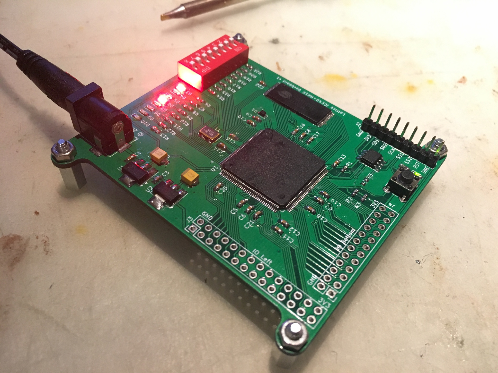

# Hisame  
氷雨 - IceStorm

### Development board for the Lattice iCE40 HX1K FPGA

Features:

* 8 LEDs
* 8 Switches
* On board Oscillator
* 128K SRAM
* 44 available IO on header pins

It allows 3 modes of operation:

1. Configuring from SPI flash memory
2. Configuring from an external SPI master device such as a Raspberry Pi (3.3V!)
3. Programming the SPI flash memory from an external SPI master device

Binaries can be built with the IceStorm toolchain or the official Lattice tools.

Bugs:

* GNDPLL is connected to Ground. Using the PLLs might cause issues.
* For FPGA configuration from SPI flash SS and CS_FLASH must be connected.  
  Fix: Don't place R5 and put a jumper between SS1 and SS2 when FPGA should configure from SPI flash.
